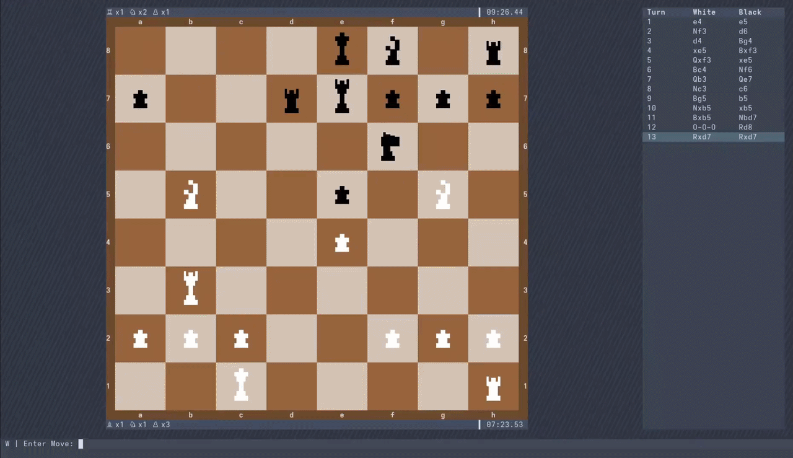

<div align="center">
<h1>Local-Chess</h1>
</div>

Local-Chess is a local-first and open-source way to play chess in the terminal. It allows users to play against each other on the same machine or over a LAN connection and incorporates a home-made chess simulation with a beautiful TUI front-end (powered by textual).



## Installation

**pypi** - (requires python 3.14+)

```sh
pipx install local-chess
```

Installs local-chess in a virtual environment to ensure that there are no dependency conflicts. Alternatively you could also try: 

```sh
pip install local-chess
```

Both of these approaches install an entry point script such that local-chess can be run anywhere in the terminal by entering:

```sh
local-chess
```

**From a checkout** - (requires [poetry](https://python-poetry.org/))

```sh
git clone https://github.com/Leo-Milligan/Local-Chess.git
cd local-chess
poetry install
```

To run local-chess, enter the following command from within the local-chess directory:

```sh
poetry run local-chess
```

## Features

- Local two-player mode
- Play with opponents on your local network
- Various time control modes
- Move-by-move game review with navigation controls
- Customisation options (board colour + piece style)

## Controls

Chess inputs are made through entering moves into the input bar in [algebraic notation](https://en.wikipedia.org/wiki/Algebraic_notation_(chess)). At times the programme will try to help with any input errors. For example, giving you options to remove piece ambiguity or asking whether you meant to take a piece etc.

You can either use the mouse to select buttons or swap between them using **TAB** and **SHIFT+TAB**.
